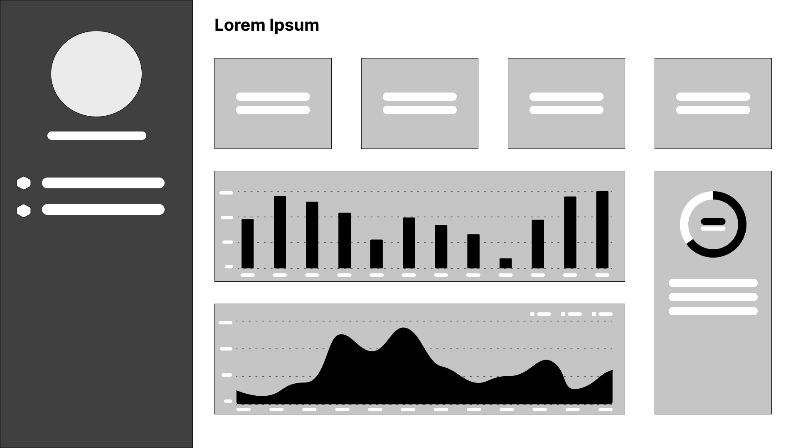

# Especificação do projeto

## Descrição do problema
A falta de dados precisos e atualizados dificultava a implementação de políticas inclusivas. Sem uma compreensão abrangente da situação, era difícil identificar áreas com maior necessidade de investimento e aprimoramento.

## Descrição da solução
Criar um projeto de demonstração de indicadores por meio de um dashboard interativo. Esse dashboard seria uma ferramenta poderosa para visualizar dados relevantes e tomar decisões informadas sobre políticas públicas de educação inclusiva.

## Persona
**Jony, 32 anos, administrador.**

Jony, trabalha em um órgão governamental voltado para o desenvolvimento de políticas públicas. Recentemente, sua equipe recebeu o desafio de entender o acesso à educação básica dos alunos com deficiência ou mobilidade reduzida em todo o país.

* Necessiades: Analisar o acesso à educação básica dos alunos
* Objetivo: implementação de políticas públicas.

## Jornada do usuário
* **Vsualização:** O usuário tem acesso a uma página com todas as visualizações
* **Filtragem:**
    * Filtrar os indicadores para regioes especificas
    * Filtrar os indicadores para tipo de dependência
    * Filtrar os indicadores para tipo de Localização

## Histórias de usuários
1. Como um administrador responsável pela implementação de políticas públicas:

* Quero acessar visualizações de dados específicas por região, tipo de dependência da escola e localização,
* Para que eu possa analisar o acesso à educação básica dos alunos com deficiência ou mobilidade reduzida e desenvolver políticas públicas eficazes que melhorem esse acesso de forma equitativa em todo o país.

### Critérios de Aceite:

* As vizualizações devem estar em gráficos interativos.

## Wireframe

[Projeto no Figma](https://www.figma.com/design/AmHYUbOwzMewX8eDciKP9J/Dashboard?node-id=1-2&t=y9nTREr5zDwnPWrY-0)